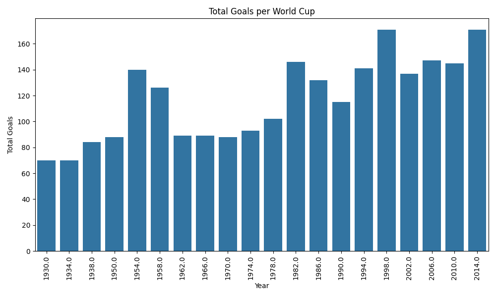
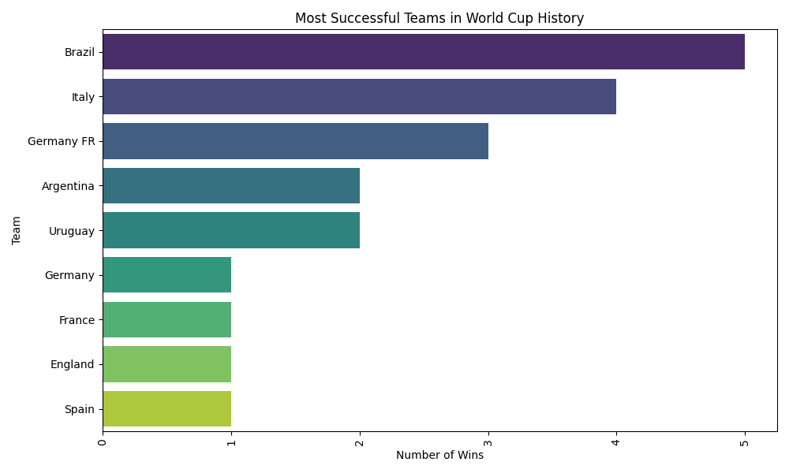
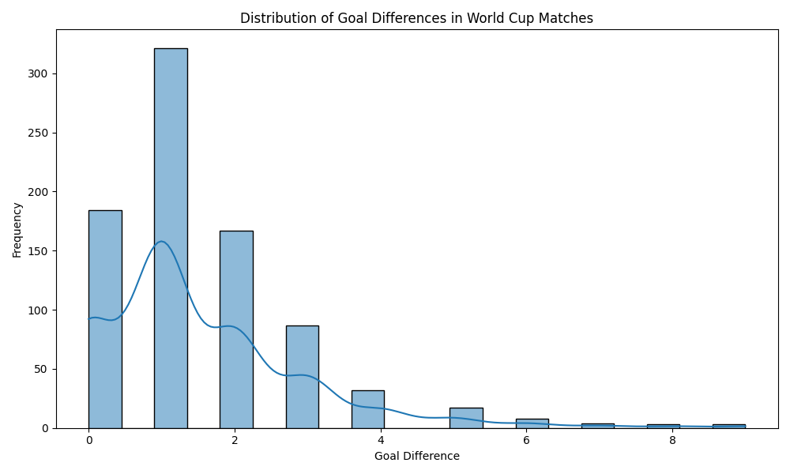

FIFA World Cup Analysis

This project analyzes FIFA World Cup data to provide insights through data engineering and visualization. The project involves loading, cleaning, transforming, and visualizing the data to uncover interesting trends and patterns in World Cup history.

## Project Structure

- **data/**: Contains the dataset CSV files.
  - `WorldCupMatches.csv`: Data about World Cup matches.
  - `WorldCupPlayers.csv`: Data about World Cup players.
  - `WorldCups.csv`: Data about World Cup tournaments.
- **scripts/**: Python scripts for data processing.
  - `data_loading.py`: Script for loading the data.
  - `data_cleaning.py`: Script for cleaning the data.
  - `data_transformation.py`: Script for transforming the data.
  - `data_visualization.py`: Script for visualizing the data.
  - `main.py`: Main script to execute the data pipeline.
- **notebooks/**: Jupyter notebooks for exploratory analysis.
  - `exploratory_analysis.ipynb`: Notebook for initial data exploration and analysis.
- **requirements.txt**: Lists the dependencies required to run the project.
- **README.md**: Project documentation and instructions.
- **.gitignore**: Git ignore file to exclude unnecessary files from version control.

## Setup

### Prerequisites

- Python 3.7 or higher
- pip (Python package installer)

### Installation

1. **Clone the repository:**

   ```bash
   git clone https://github.com/your-username/fifa-world-cup-analysis.git
   cd fifa-world-cup-analysis
   ```

2. **Install the required packages:**

   ```bash
   pip install -r requirements.txt
   ```

### Running the Project

1. **Execute the main script:**

   ```bash
   python scripts/main.py
   ```

   This will load the data, clean it, perform transformations, and generate visualizations.

## Data Sources

The datasets used in this project are from Kaggle:

- [WorldCupMatches.csv](https://www.kaggle.com/datasets/abecklas/fifa-world-cup/data)
- [WorldCupPlayers.csv](https://www.kaggle.com/datasets/abecklas/fifa-world-cup/data)
- [WorldCups.csv](https://www.kaggle.com/datasets/abecklas/fifa-world-cup/data)

## Scripts Description

### `data_loading.py`

Contains the function `load_data()` that loads the datasets from CSV files.

### `data_cleaning.py`

Contains the function `clean_data()` that handles missing values, standardizes date formats, and removes duplicates.

### `data_transformation.py`

Contains the function `transform_data()` that creates new columns, aggregates data, and prepares it for analysis.

### `data_visualization.py`

Contains functions for creating visualizations:
- `plot_total_goals(total_goals_per_cup)`: Plots total goals per World Cup.
- `plot_most_successful_teams(winning_teams)`: Plots the most successful teams in World Cup history.
- `plot_goal_difference_distribution(matches)`: Plots the distribution of goal differences in World Cup matches.

### `main.py`

The main script that orchestrates the data loading, cleaning, transformation, and visualization steps by calling the appropriate functions from other scripts.

## Notebooks

### `exploratory_analysis.ipynb`

Jupyter notebook for initial data exploration and analysis. It provides a more interactive way to understand the data and experiment with different analyses.

## Visualization Examples

### Total Goals per World Cup



### Most Successful Teams



### Goal Difference Distribution



## License

This project is licensed under the MIT License - see the [LICENSE](LICENSE) file for details.

## Acknowledgements

- The datasets used in this project are sourced from Kaggle and were originally compiled by Abecklas.
- This project uses `pandas`, `matplotlib`, and `seaborn` for data manipulation and visualization.

## Contributing

Contributions are welcome! Please open an issue or submit a pull request for any changes or improvements.

## Contact

For any questions or inquiries, please contact [mateusz.gruszka@linux.pl].
